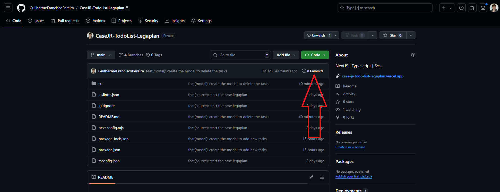
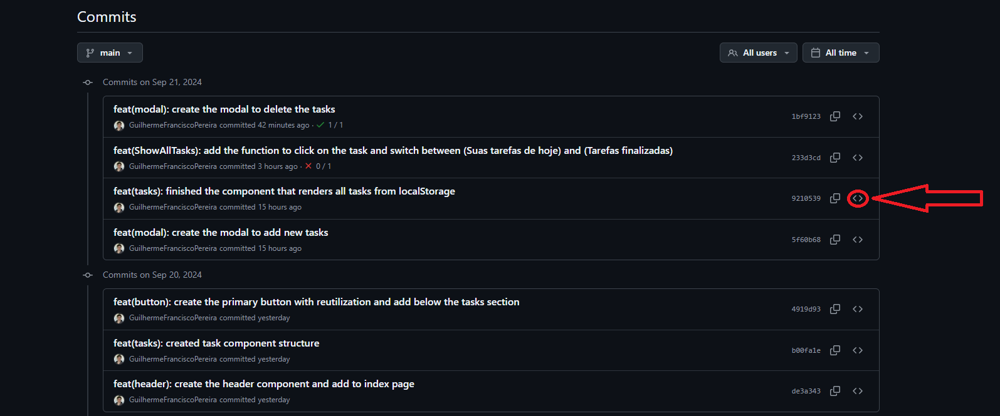
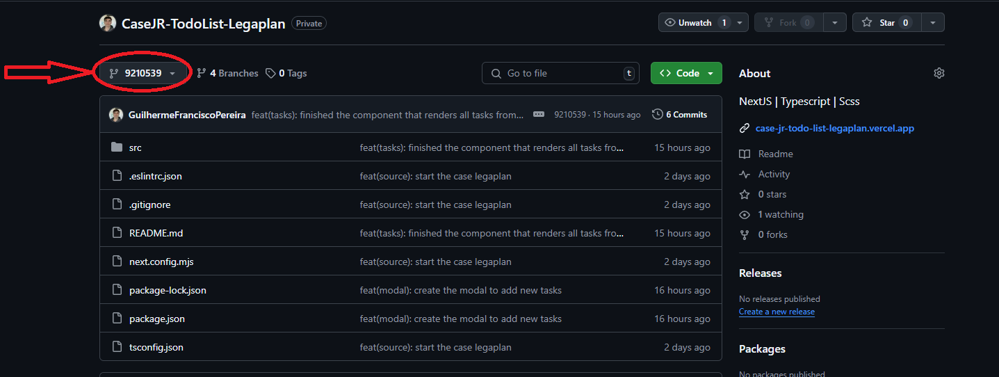

#   Case Dev Junior - TodoList - Legaplan 

## 📌 Sobre o case:

### Este projeto é um desafio proposto pela equipe da LegaPlan para uma vaga de dev Junior, os pontos levantados são:
- O projeto deve ser criado utilizando NextJS utilizando o App Router e SCSS
- Além das boas práticas de programação, esperamos ver fidelidade MÁXIMA ao design. Preste atenção aos detalhes como sombras, gradientes, entre outros

##

> 🔗 Link do site: <a href="https://case-jr-todo-list-legaplan.vercel.app" target="_blank">https://case-jr-todo-list-legaplan.vercel.app</a>

# 

## 🖥️ Primeira versão do site - (PC):


## 📱 Primeira versão do site - (Mobile):


## 💭 Como está o LocalStorage:


##

#

## 🖥 Tecnologias Utilizadas
<div align='center'>


</div>

    - Next
    - React
        - React-query
    - Typescript
    - Scss

## Versões utilizadas:
    - Next: 14.2.12
    - React: 18
        - React-query: 3.39.3
    - Typescript: 5
    - Scss: 1.79.1

## 🙋🏻‍♂ Como me localizar no projeto?

### Todos os arquivos de código fonte do projeto estão em: `./src`

## 🛈 Como o projeto está estruturado

- `./src/app:` Este projeto com o App Router, entretanto não temos nenhuma outra rota. Então esta pasta você pode localizar a nossa página index e o layout com as configurações e o favicon do site.

- `./src/assets:` Onde está todas as fotos que vão ser usadas no projeto.

- `./src/components:` Onde está os componentes que serão reutilizados em diversas partes do código. Nesta primeira versão do site temos os components:
    - Botão: Buttons
    - Cabeçalho: Header
    - Responsável por renderizar todas as tarefas do Local Storage: LocalStorage
    - Os dois Modais: Modal
    - Responsável por agrupar tudo e ser renderizado no Page: Tasks
- `./src/contexts:` Os contexts são onde separamos os dados que serão compartilhados com toda a aplicação, neste projeto na primeira versão é onde está os contextos dos Modais ( pasta: Modals).
    - Vale ressaltar que o arquivo 'AppProvider.tsx' é o responsável por agrupar todos os providers dos contextos e exportar como um arquivo único. 

- `./src/hooks:` Está nossos hooks personalizados com as partes lógicas da aplicação. 

- `./src/services:` Pasta que contém as funcionalidades de serviço. Com a primeira versão temos um único arquivo "QueryClient.ts" que serve somente para criarmos um QueryClient e exportar o provider neste próprio arquivo, uma vez que assim podemos usar a diretiva 'use client' no arquivo e não no layout da aplicação.

- `./src/styles:` Pasta que contém os arquivos de estilização. Nesta primeira versão temos também um único arquivo, chamado "GlobalStyles.scss", este arquivo fica responsável pelos códigos que são de estilização globais do projeto.

## ❔ Como rodar o projeto na minha máquina?

- Vale ressaltar que já está o link do site no topo desta documentação. Mas caso queira analisar o código fonte fique a vontade para instalar este case na sua máquina! Tutorial a baixo:

- Antes de tudo, você precisa ter o Git instalado no seu computador. O Git é uma ferramenta que permite clonar e gerenciar repositórios de código.
    - Windows: Baixe o Git <a href="https://git-scm.com/download/win" target="_blank">aqui</a> e siga as instruções de instalação.
    - macOS: Você pode instalar o Git <a href="https://git-scm.com/download/mac" target="_blank">aqui</a> ou usando o Homebrew com o comando brew install git:
        ```bash
        brew install git
        ```
    - Linux: Use o gerenciador de pacotes da sua distribuição, por exemplo para Debian/Ubuntu:
        ```bash
        sudo apt install git
        ```

- Abra o terminal (no Windows, você pode usar o Git Bash, que é instalado junto com o Git).

- Navegue até o diretório onde deseja armazenar o projeto.

- Execute o comando para clonar o repositório:

    ```bash
    git clone https://github.com/GuilhermeFranciscoPereira/CaseJR-TodoList-Legaplan.git
    ```
- Após clonar o repositório, navegue até a pasta do projeto
    ```bash
    cd CaseJR-TodoList-Legaplan
    ```

- Agora você pode abrir os arquivos do projeto com seu editor de texto ou IDE preferido. Exemplo do vsCode: 
    ```bash
    code .
    ```

- 🚨 Não esqueça que para não ocorrer erros no código ao clonar ele, você deve fazer o comando abaixo 🚨
    ```bash
    npm i   
    ```

- Pronto! Todo o site estará funcionado na sua máquina. Porém, caso precise de alguma ajuda em algo entre em contato comigo pelo meu LinkedIn: https://www.linkedin.com/in/guilherme-francisco-pereira-4a3867283

## ⚠ Informações importantes sobre o projeto ⚠

### Todos os commits do projeto possuem um readme detalhado do que foi feito naquele commit e também possuem as fotos versão do site naquele momento, então caso deseje ver o processo de criação do código viaje pelos commits e veja as informações!

### Como fazer isso? 

Para você ver o processo de criação e o que foi feito em cada commit siga o passo-a-passo:

#### Primeiro: Nessa guia em que você está, suba a tela até encontrar embaixo do botão verde um local igual o da foto abaixo e então clique nele


#### Segundo: No lado direito dos commits você encontra clique no simbolo de <> como está na foto e então você irá encontrar como o código estava naquele momento e o readme detalhado daquele momento!


#### Terceiro: Depois de encontrar tudo que deseja, caso queira voltar para cá, você irá clicar no local em que a imagem a baixo mostra:


#### E então clique em `main` e voltará para cá!

##

## 🎉 É isso! Esse foi o nosso case, caso tenha ficado com alguma dúvida ou deseje complementar algo diretamente comigo você pode estar entrando em contato através do meu LinkedIn

> Link do meu LinkedIn: <a href="https://www.linkedin.com/in/guilherme-francisco-pereira-4a3867283" target="_blank">https://www.linkedin.com/in/guilherme-francisco-pereira-4a3867283</a>

### 🚀 Obrigado pela atenção e espero que tenha gostado do que tenha visto aqui, que tal agora dar uma olhada nos meus outros repositórios? 👋🏻

#

### ❤️ Créditos:

- #### Créditos do figma total a equipe LegaPlan:
> <a href="https://www.figma.com/design/4iESWnasLZSHyghg1ipj1P/Teste-Dev-Junior---Legaplan?node-id=0-1&node-type=canvas&t=GxQUSS4KxQUWBUBN-0" target="_blank">https://www.figma.com/design/4iESWnasLZSHyghg1ipj1P/Teste-Dev-Junior---Legaplan?node-id=0-1&node-type=canvas&t=GxQUSS4KxQUWBUBN-0</a>

- #### Créditos dos emojis: 
> <a href="https://emojipedia.org" target="_blank">https://emojipedia.org</a>

- #### Créditos dos badges: 
> <a href="https://shields.io" target="_blank">https://shields.io</a>